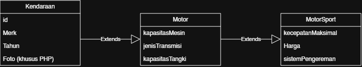
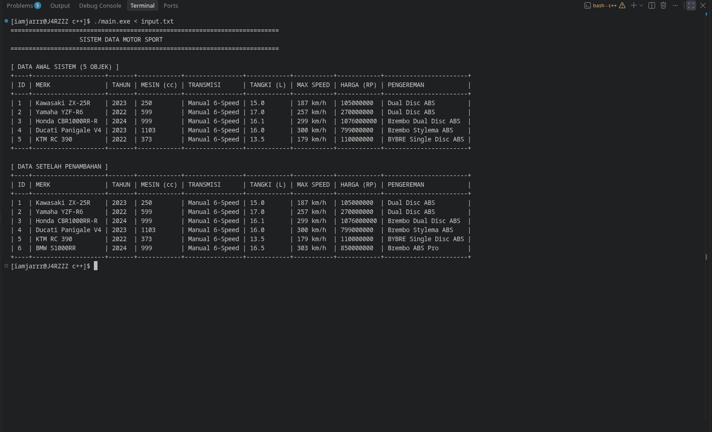
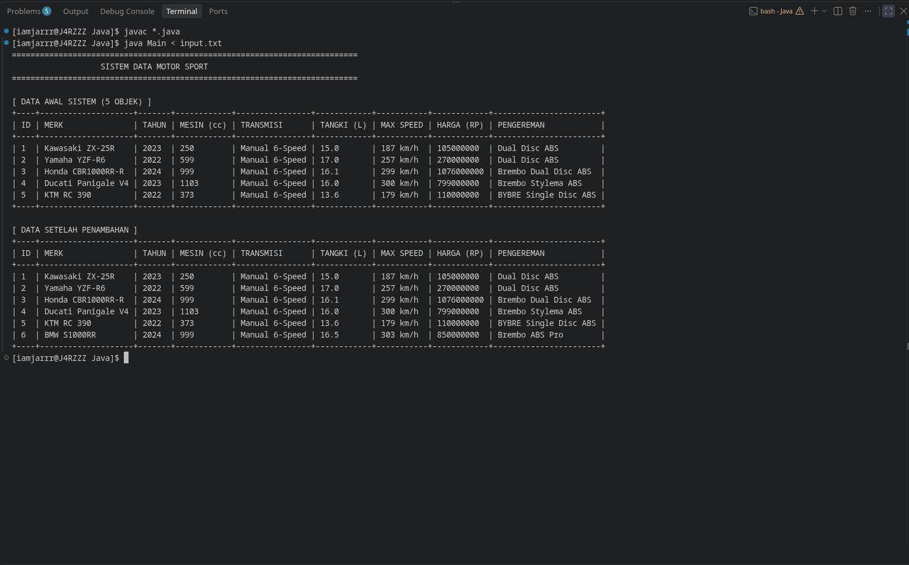
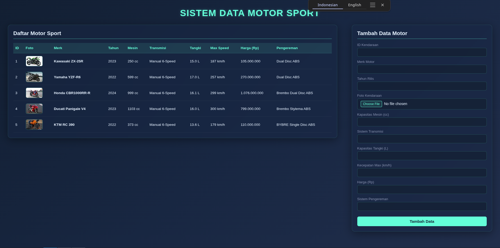
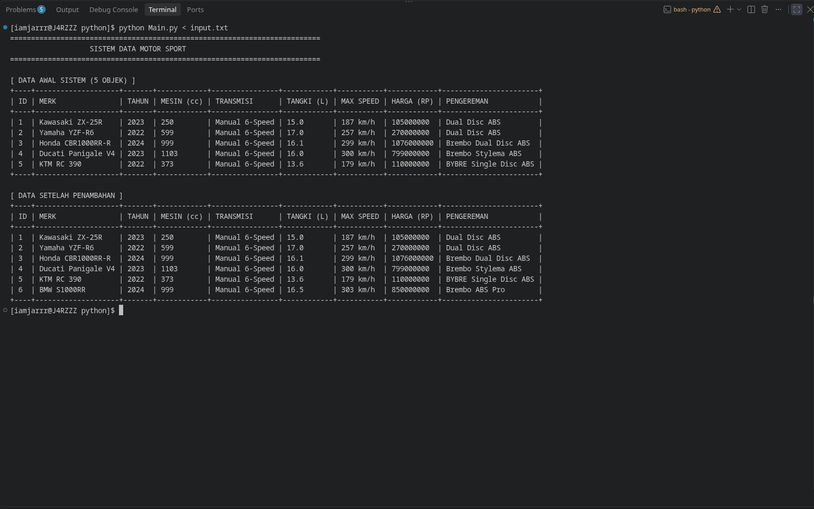

# Tugas Praktikum 2 DPBO — Multilevel Inheritance

## Janji

Saya Afit Fajar dengan NIM 2501826 mengerjakan Tugas Praktikum 2 pada Mata Kuliah Desain dan Pemrograman Berorientasi Objek (DPBO) untuk keberkahan-Nya maka saya tidak melakukan kecurangan seperti yang telah dispesifikasikan. Aamiin.

---

# Deskripsi Program

Program ini merupakan implementasi konsep **Object-Oriented Programming (OOP)** dengan menggunakan **Multilevel Inheritance** atau pewarisan bertingkat.

Studi kasus yang digunakan adalah **kendaraan**, dengan tiga buah class yang memiliki hubungan pewarisan secara bertingkat:

```text
Kendaraan
    ↓ extends
  Motor
    ↓ extends
MotorSport
```

Dengan struktur tersebut, `Motor` merupakan turunan dari `Kendaraan`, sedangkan `MotorSport` merupakan turunan dari `Motor`.

Konsep ini menunjukkan bahwa sebuah class turunan dapat memperoleh atribut dan perilaku dari class induknya, kemudian menambahkan atribut atau perilaku yang lebih spesifik sesuai dengan karakteristik objek tersebut.

Program diimplementasikan dalam beberapa bahasa pemrograman, yaitu:

- C++
- Java
- PHP
- Python

---

# Struktur File

```text
TP2DPBO2526C2/
├── Dokumentasi/
│   ├── C++/
│   │   └── c++.png
│   ├── Java/
│   │   └── Java.png
│   ├── PHP/
│   └── Python/
│       └── Python.png
│
├── Program/
│   ├── c++/
│   │   ├── input.txt
│   │   ├── Kendaraan.cpp
│   │   ├── Main.cpp
│   │   ├── Motor.cpp
│   │   └── MotorSport.cpp
│   │
│   ├── Java/
│   │   ├── input.txt
│   │   ├── Kendaraan.java
│   │   ├── Main.java
│   │   ├── Motor.java
│   │   └── MotorSport.java
│   │
│   ├── php/
│   │   ├── img/
│   │   ├── index.php
│   │   ├── Kendaraan.php
│   │   ├── Motor.php
│   │   └── MotorSport.php
│   │
│   └── python/
│       ├── input.txt
│       ├── Kendaraan.py
│       ├── Main.py
│       ├── Motor.py
│       └── MotorSport.py
│
└── README.md
```

---

# Desain / Class Diagram

Class diagram yang digunakan dalam program adalah sebagai berikut:

<div align="center">
    
</div>

### 1. `Kendaraan` → Parent Class

`Kendaraan` merupakan class paling dasar atau parent class.

Class ini berisi atribut yang bersifat umum dan dapat dimiliki oleh berbagai jenis kendaraan, yaitu:

- `id`
- `Merk`
- `Tahun`
- `Foto` — khusus implementasi PHP

Atribut tersebut menjadi dasar informasi sebuah kendaraan.

### 2. `Motor` → Child Class dari `Kendaraan`

`Motor` merupakan turunan langsung dari `Kendaraan`.

Karena `Motor` mewarisi `Kendaraan`, maka sebuah objek `Motor` memiliki atribut dari `Kendaraan` sekaligus atribut tambahan yang khusus menggambarkan karakteristik motor.

Atribut tambahan pada `Motor` adalah:

- `kapasitasMesin`
- `jenisTransmisi`
- `kapasitasTangki`


### 3. `MotorSport` → Child Class dari `Motor`

`MotorSport` merupakan turunan dari `Motor`.

Karena `Motor` sendiri merupakan turunan dari `Kendaraan`, maka `MotorSport` secara tidak langsung juga memperoleh atribut yang berasal dari `Kendaraan`.

Selain itu, `MotorSport` memiliki atribut khusus, yaitu:

- `kecepatanMaksimal`
- `Harga`
- `sistemPengereman`

# Penjelasan Atribut dan Method

## Atribut Class `Kendaraan`

| Atribut | Keterangan |
|---|---|
| `id` | Identitas atau nomor unik dari data kendaraan. |
| `Merk` | Menyimpan informasi merek kendaraan. |
| `Tahun` | Menyimpan informasi tahun kendaraan. |
| `Foto` | Menyimpan foto kendaraan dan digunakan khusus pada implementasi PHP. |

`Kendaraan` hanya menyimpan informasi dasar yang bersifat umum sehingga atributnya dapat diwariskan kepada class kendaraan yang lebih spesifik.

---

## Atribut Class `Motor`

| Atribut | Keterangan |
|---|---|
| `kapasitasMesin` | Menyimpan informasi kapasitas mesin motor. |
| `jenisTransmisi` | Menyimpan jenis transmisi yang digunakan oleh motor. |
| `kapasitasTangki` | Menyimpan kapasitas tangki bahan bakar motor. |

Atribut pada `Motor` melengkapi informasi dasar yang sudah diperoleh dari `Kendaraan`.

---

# Dokumentasi Program

## C++

<div align="center">
    
</div>

Dokumentasi di atas menunjukkan hasil implementasi program menggunakan bahasa C++.

---

## Java

<div align="center">
    
</div>

Dokumentasi di atas menunjukkan hasil implementasi program menggunakan bahasa Java.

---

## PHP

<div align="center">
    
</div>

Dokumentasi di atas menunjukkan hasil implementasi program menggunakan bahasa PHP.

---

## Python

<div align="center">
    
</div>

Dokumentasi di atas menunjukkan hasil implementasi program menggunakan bahasa Python.

---
